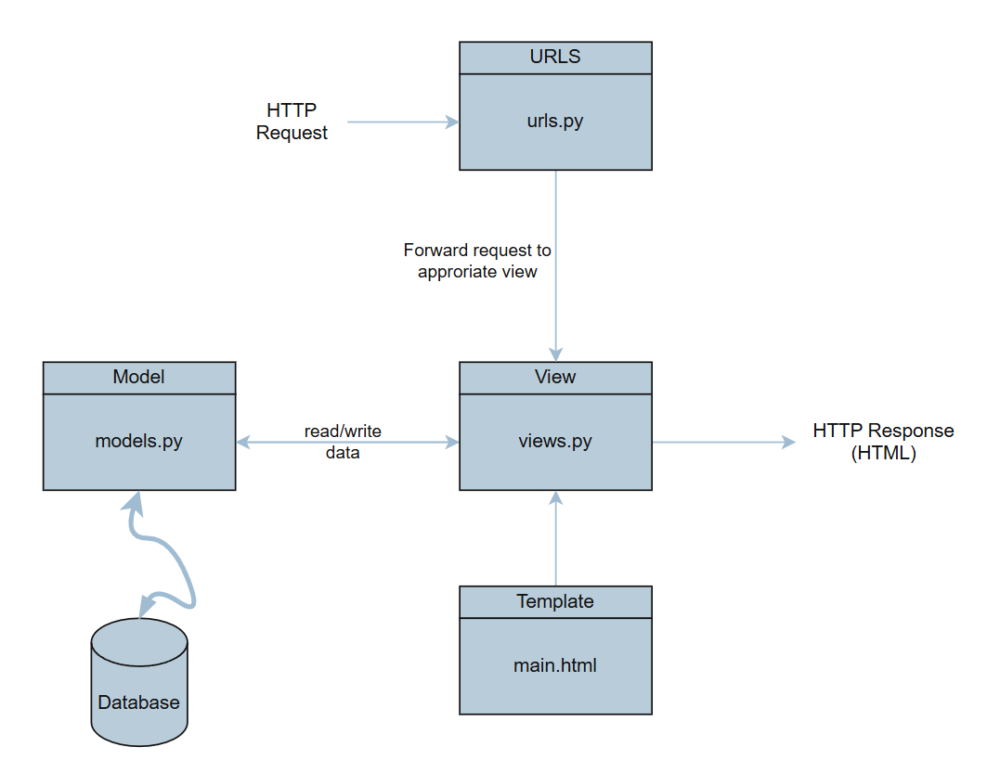

Link Deploy : https://wildan-al41-sultansport.pbp.cs.ui.ac.id/

1.  Jelaskan bagaimana cara kamu mengimplementasikan 
checklist di atas secara step-by-step (bukan hanya sekadar mengikuti tutorial).

Sebelum masuk ke bagian cheklist, saya membuat repository baru bernama sultan-sport yang akan digunakan untuk mengerjakan tugas ini

    a. Membuat sebuah proyek Django baru.

        Saya mendownload semua requirements untuk django terlebih dahulu, detailnya ada di file requirement.txt
        Setelah itu saya membuat proyek django bernama sultan_sport serta mengkonfigurasikan variables dan proyek django nya

    b. Membuat aplikasi dengan nama main pada proyek tersebut.

        Saya membuat aplikasi baru bernama main dalam proyek sultan_sport degan perintah python manage.py startapp main, lalu saya juga mendaftarkan aplikasinya di setting.py di proyek sultan_sport, lebih tepatnya dibagian INSTALLED_APPS

    c. Melakukan routing pada proyek agar dapat menjalankan aplikasi main.

        Untuk melakukan routing, pertama - tama saya membuat berkas urls.py di main, lalu mengisi filenya dengan kode 

        from django.urls import path
        from main.views import show_main

        app_name = 'main'

        urlpatterns = [
            path('', show_main, name='show_main'),
        ]

    d. Membuat model pada aplikasi main dengan nama Product dan memiliki atribut wajib sebagai berikut.

        Dalam membuat model, sebenarnya saya menggunakan template dari tutorial 1, tapi saya merubahnya seperti ketentuan tugas 2, yang saya rubah antara lain, merubah namanya dari News menjadi Product, lalu merubah CATEGORY_CHOICES menjadi PRODUCT_CHOICES serta merubah isi dictionarynya. Saya juga merubah atribut nya seperti ketentuan yang ada di tugas 2 tetapi saya menambahkan 2 atribut baru yaitu adress dan stock

    e. Membuat sebuah fungsi pada views.py untuk dikembalikan ke dalam sebuah template HTML yang menampilkan nama aplikasi serta nama dan kelas kamu.

        Saya membuka berkas views.py di folder main, lalu saya memberikan fungsi show_main yang berisikan nama dan npm saya, lalu di file main.html nya saya panggil kembali nama dan kelas saya dari file views.py, lalu saya menambahkan judul di berkas main.html saya

    f. Membuat sebuah routing pada urls.py aplikasi main untuk memetakan fungsi yang telah dibuat pada views.py.
        
        saya membuka berkas urls.py di folder sultan-sport, saya menambahkan kode

        from django.urls import path, include

        serta menambahkan kode

        path('', include('main.urls')),

        didalam url pattern

    g. Melakukan deployment ke PWS terhadap aplikasi yang sudah dibuat sehingga nantinya dapat diakses oleh teman-temanmu melalui Internet.

        Saya membuka website pws, lalu membuat project baru, lalu saya hubungkan pws itu kedalam proyek saya, awalnya saya bingung kenapa selalu gagal build, ternyata saya lupa untuk ngepush git saya ke pws, ini memakan 1 jaman lebih :' .

2. Buatlah bagan yang berisi request client ke web aplikasi berbasis Django beserta responnya dan jelaskan pada bagan tersebut kaitan antara urls.py, views.py, models.py, dan berkas html.

    

3. Jelaskan peran settings.py dalam proyek Django!

    Dalam proyek Django, settings.py berfungsi sebagai pusat pengaturan utama yang mengendalikan cara aplikasi berjalan. Di dalamnya tersimpan konfigurasi penting, mulai dari aplikasi apa saja yang digunakan, middleware yang aktif, hingga bagaimana proyek terhubung dengan database. File ini juga mengatur aspek keamanan, seperti secret key, daftar host yang diizinkan, serta status debug untuk membedakan antara lingkungan pengembangan dan produksi. Selain itu, settings.py memuat aturan mengenai lokasi file statis dan media, pengaturan bahasa serta zona waktu, bahkan konfigurasi tambahan seperti email, autentikasi, dan logging. Dengan kata lain, settings.py adalah jantung pengaturan proyek Django yang memastikan semua komponen dapat bekerja selaras sesuai kebutuhan aplikasi.

4. Bagaimana cara kerja migrasi database di Django?

    Dalam Django, migrasi database bekerja sebagai jembatan antara model yang ditulis di Python dengan struktur tabel yang ada di database. Setiap kali pengembang membuat atau mengubah model, Django tidak langsung mengubah database, melainkan mencatat perubahan tersebut dalam sebuah file migrasi. File inilah yang berisi instruksi tentang apa yang harus ditambahkan, diubah, atau dihapus di dalam tabel. Setelah itu, ketika migrasi dijalankan, Django menerjemahkan instruksi tersebut menjadi perintah SQL dan mengeksekusinya ke database. Dengan cara ini, database selalu mengikuti perkembangan model tanpa perlu menulis query manual, sekaligus menjaga riwayat perubahan agar mudah dilacak atau dikembalikan jika diperlukan.

5. Menurut Anda, dari semua framework yang ada, mengapa framework Django dijadikan permulaan pembelajaran pengembangan perangkat lunak?

    Django sering dijadikan permulaan dalam pembelajaran pengembangan perangkat lunak karena sifatnya yang terstruktur, lengkap, dan ramah untuk pemula sekaligus kuat untuk proyek nyata. Django membawa filosofi “batteries included”, artinya sebagian besar fitur penting untuk membangun aplikasi web sudah tersedia tanpa perlu memasang banyak tambahan—mulai dari autentikasi pengguna, sistem manajemen database, hingga keamanan dasar. Hal ini membantu pemula agar bisa fokus memahami konsep inti pengembangan perangkat lunak, bukan sibuk dengan detail teknis yang terpecah-pecah.

    Selain itu, Django menerapkan pola arsitektur MTV (Model-Template-View) yang serupa dengan konsep MVC, sehingga pengembang sejak awal terbiasa dengan pembagian tanggung jawab kode secara rapi dan terstruktur. Django juga menekankan praktik terbaik, seperti keamanan default, penggunaan ORM untuk mengelola database, serta dukungan migrasi yang membuat perubahan skema lebih mudah dan terkontrol.

    Dengan dokumentasi yang lengkap, komunitas besar, dan ekosistem yang matang, Django memberi pengalaman belajar yang tidak hanya teoritis, tetapi juga relevan dengan kebutuhan industri. Karena itulah, banyak program atau kursus menjadikannya framework awal agar mahasiswa atau pemula bisa memahami alur kerja sebuah aplikasi web modern secara menyeluruh sebelum melangkah ke teknologi lain yang lebih spesifik atau ringan.

6. Apakah ada feedback untuk asisten dosen tutorial 1 yang telah kamu kerjakan sebelumnya?

    Mungkin jika berkenan, untuk setiap tugas atau tutorial yang telah dilakukan, bisa berikan feedback agar saya tahu dimana kurangnya saya dalam mengerjakan tugas, terimakasih